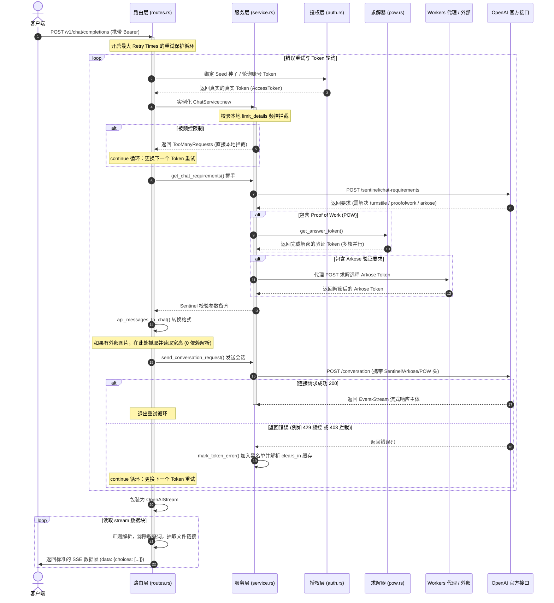

# Rust 重构版本核心流程文档

本文档详细描述客户端请求被接收，直至向 OpenAI 官方会话并以 SSE 响应返回给客户端的完整处理流程。

---

## 1. Completions 核心业务流图

下面的序列图展示了请求进入系统后，各个模块协作处理并流式响应的整个生命周期：



---

## 2. 核心子业务控制流

### 2.1 消息转换与多模态下载流程

当客户端传入多模态内容（`image_url`）时，系统的流式处理步骤如下：

```text
[开始解析 messages] 
       │
       ▼
[检查类型 type == "image_url"] ──(No)──► [常规文本直接追加到 parts]
       │ (Yes)
       ▼
[判断 URL 协议]
       ├─► (data:image/...) ──► [Base64 直接内联解码为字节数据]
       └─► (http/https)   ──► [检查是否存在 CF_FILE_URL 代理]
                                     ├─► (Yes) ──► [使用 POST 通过 cf_file_url 中转下载]
                                     └─► (No)  ──► [带入 EXPORT_PROXY_URL 下载图片]
       │
       ▼
[利用 get_image_size 二进制扫描提取图片宽高] ──(失败)──► [回退为普通非图片附件上传]
       │ (成功)
       ▼
[上传文件到 OpenAI 获取 file_id] ──► [根据缩放算法累加 file_tokens]
       │
       ▼
[追加图片文件指针至会话协议的 parts]
```

### 2.2 429 会话级限流拦截与重试自愈机制

1. **接口入口**：由 `routes.rs` 捕获到用户 Completions 请求。
2. **前置限流判定**：
    在 `ChatService::new` 内，从全局状态提取 `limit_details` 映射表，检索 `Token + Model`。如果存在未到期的截止时间戳，直接向路由抛出 `429 TooManyRequests` 异常，此账号在此次轮询中被跳过，直接触发下一次重试迭代。
3. **捕获异常与黑名单排除**：
    向 OpenAI 发起请求若遭遇 `429` 响应，解析 Body 中的 `clears_in`，登记拦截信息，并将此 Token 移入 `error_token_list` 缓存列表防再次调度。
4. **接口自愈**：
    重试循环自动进入下一轮，通过 `get_req_token` 会自动筛选出不在 `error_token_list` 中的健康账号，从而无感恢复服务。
